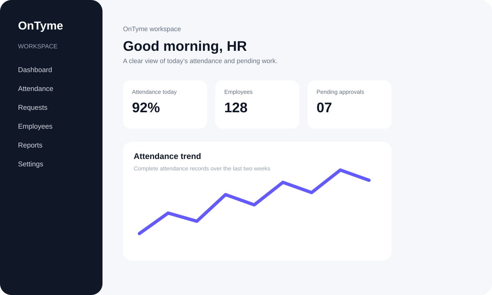
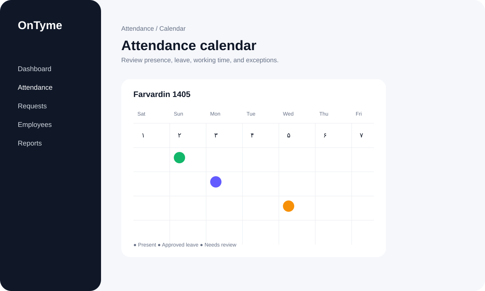

<div align="center">
  
  <h1>OnTyme</h1>
  <p><strong>Attendance, time-off, and workforce operations for modern organizations.</strong></p>
  <p>Turn everyday employee time data into clear decisions, accountable workflows, and a better workday.</p>

  <p>
    <a href="https://github.com/AshkaanGiveki/hozoor"></a>
    
    
    
  </p>
</div>

## What is OnTyme?

OnTyme is a flexible workforce operations platform for companies, teams, and organizations that need a reliable source of truth for attendance, working time, leave, hourly exits, approvals, and operational reporting.

It brings the complete attendance lifecycle into one calm, structured workspace: define policies, organize employees, import device events, calculate daily status, route requests for approval, and give every stakeholder the right level of visibility.

> The repository was previously known as **Hozoor**. The product and interface are now branded as **OnTyme**.

## Product tour

<p align="center">
  
  
</p>

These lightweight repository previews reflect the product’s main information architecture. Run the application locally for the interactive experience.

## Capabilities

### Attendance and working time

- Daily attendance calendar with Persian/Jalali date support and timezone-aware calculations.
- First-in, last-out, valid work time, required time, deficit, overtime, lateness, and early-departure metrics.
- Rich day statuses including present, absent, incomplete, approved leave, hourly leave, hourly exit, holiday, weekly rest, mission, remote work, and insufficient time.
- Versioned attendance policies with effective dates, grace periods, minimum daily minutes, overtime modes, and custom working rules.
- Attendance groups so different teams can follow different schedules and rules.
- Import workflows for CSV and XLSX device exports with preview, identifier mapping, duplicate detection, and idempotent processing.

### Leave, day-offs, and requests

- Configurable leave types with day-based or hour-based consumption.
- Employee requests for leave, hourly exit, and attendance correction.
- Request history with status, reason, dates, requested minutes, and approval trail.
- Multi-step approval routing for managers, HR administrators, and organization administrators.
- Clear handling of approved leave and hourly exits inside attendance calculations.

### Organization and employee administration

- Employee directory with employee codes, departments, teams, attendance groups, and active status.
- Company profile and organization settings managed separately from personal account settings.
- Role-aware access for administrators, HR administrators, managers, and employees.
- Scoped visibility so managers and operators see only the data they are authorized to manage.

### Dashboards and reporting

- Role-aware dashboard with today’s attendance health, recent activity, pending work, quick actions, and team discipline signals.
- Personal and organization-level attendance views from the same platform.
- Attendance reports with filters, totals, daily trends, work-time detail, anomalies, leave, hourly exits, and overtime.
- CSV/XLSX-friendly reporting workflows for payroll, operations, and management follow-up.
- Notifications for operational events and pending actions.

### Security and localization

- Secure sessions with Argon2id password hashing and forced first-login password change support.
- Password management, session logout, audit events, and permission-aware server actions.
- RTL-first Persian interface with bundled IRANSansX typography.
- Light and dark themes designed for long operational work sessions.
- UTC-safe persistence with configurable application timezone behavior.

## How OnTyme fits together

```text
Device exports / manual events
              ↓
     Import + validation layer
              ↓
   Attendance engine + policies
              ↓
 Calendar · dashboard · reports
              ↓
 Requests · approvals · audit trail
```

## Quick start

### Docker (recommended)

```bash
docker compose up -d --build
```

Open [http://localhost:3000](http://localhost:3000). The container starts PostgreSQL, applies Prisma migrations, and prepares the application for first use.

### Local development

```bash
corepack pnpm install
corepack pnpm prisma generate
corepack pnpm dev
```

Local development requires PostgreSQL. Copy `.env.example` to `.env` and set `DATABASE_URL`, `SESSION_SECRET`, and `APP_URL` for your environment.

## Demo accounts

For seeded development data, use:

| Role | Username | Password |
| --- | --- | --- |
| HR administrator | `hr` | `HrDemo123!` |
| Organization administrator | `admin` | `ChangeMe123!` |
| Manager | `manager` | `Manager123!` |
| Employee | `employee1` | `Employee123!` |

These credentials are for local/demo environments only. Change all seeded passwords before any real deployment.

## Quality checks

```bash
corepack pnpm typecheck
corepack pnpm lint
corepack pnpm test
corepack pnpm build
```

## Architecture and operations

- [Architecture](./ARCHITECTURE.md)
- [Deployment](./DEPLOYMENT.md)
- [Security](./SECURITY.md)
- [Attendance policy model](./docs/attendance-policy.md)
- [Leave policy model](./docs/leave-policy-model.md)
- [Device import format](./docs/device-import-format.md)
- [Backup and restore](./docs/backup-and-restore.md)

## Technology

OnTyme is built with Next.js 15, React 19, TypeScript, Prisma, PostgreSQL, Sass, Vitest, and Playwright. The application is designed as a single deployable workspace with a typed API surface, a calculation-focused server layer, and a responsive RTL interface.

## Contributing

Keep product language and domain rules consistent with the platform’s attendance model. For changes that affect calculations, policies, approvals, or permissions, add or update automated tests and document the operational behavior.

## License

This repository is maintained as a private product codebase. See the repository owner for licensing and contribution permissions.
